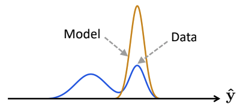
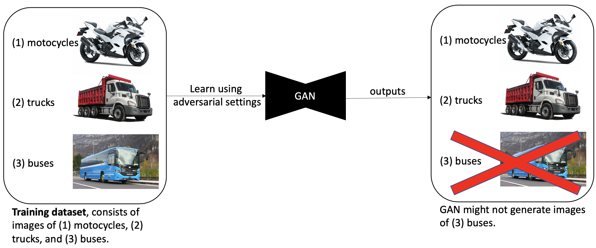

Despite GANs' popularity, a well-documented problem in practice apparently contradict theoretical guarantees. This problem is called  *mode dropping* (or *mode collapse*).
This is one reason (out of a few, covered in separated blogposts) why **we all should think twice before choosing to use GANs**.

## What is *mode dropping* (*mode collapse*)?

*Mode dropping* (also known as *mode collapse*) is the phenomenon where the model (i.e. GAN) disregards some modes in the data distribution and assigns them low density.[^1]

> 
>
> Figure from ["Overcoming Mode Collapse and the Curse of Dimensionality" IAS Workshop, Ke Li, 2019](https://drive.google.com/file/d/1PV4YN3OQprww4BCDwB9XWMUIz_mbdDab/view).
>
> 
>
> On bottom: samples synthesised by a GAN that suffers from mode dropping. It supposed to learn MNIST (i.e. generalise the distribution of MNIST), but due to mode dropping, the model outputs mostly the digit six (rather than all digits).[^3]
>
> 

## Why mode dropping is such a significant drawback of GANs?

A GAN that suffers from mode dropping does *not* learn (i.e. generalize) the true data distribution.[^2]

A notable consequence is that sample quality no longer reflects how well the model learns the underlying distribution.[^1]

> Mode dropping consequence: a GAN that generates high quality photorealistic images, does *not* necessarily generalised the training dataset distribution (and the *true* data distribution).
>
> 

Unfortunately, to date, we do not have reliable method to measure mode dropping. 
Visualization of samples no longer works because human memory constraints limit our ability to detect a deficiency in diversity compared to the training data. Comparison to the nearest training example is also problematic because it only detects almost exact memorization of a training example.[^1]

As a result, the "quantity" of mode dropping is typically not measured. This is dangerous, because we do not know how much "mode dropping" was given up in order to achieve an improvement in sample quality.[^1]

## Why GANs suffer from mode dropping?

### Mode dropping supposedly contradicts the theory

Theoreticians showed that GANs do *not* expected to suffer from mode dropping.[^1] 
They showed that minimising the (original paper's) GAN objective *do* force the model to learn the true data distribution (which can be thought of as minimising the [Jensen-Shannon divergence]([https://en.wikipedia.org/wiki/Jensen%E2%80%93Shannon_divergence](https://en.wikipedia.org/wiki/Jensen–Shannon_divergence)) between ① the *model* distribution, and ② the *true* data distribution).[^1]

Is it possible that theoretical guarantees do *not* hold in practice?

### Theoretical assumptions do *not* hold in practice

The reason for the mode dropping phenomenon (which supposedly contradicts the theoretical guarantees) is that theoretical results rely on unrealistic assumptions, including:[^4]

1. The discriminator must have infinite modelling capacity.
2. The number of samples from the true data distribution must be infinite.

## An alternative for GANs

A non-adversarial generative model, named ***GLANN***, solves the mode dropping problem (as well as the [vanishing gradient problem](/vanishing-gradient-problem-in-gans)). GLANN empirically has been shown to outperform a baseline consisting of 800 GANs and [VAEs](https://towardsdatascience.com/understanding-variational-autoencoders-vaes-f70510919f73) on commonly used datasets. For more, see my blogpost [What is GLANN?](/what-is-glann).

## References
* "On the Implicit Assumptions of GANs", Ke Li and Jitendra Malik, 2018, [https://arxiv.org/abs/1811.12402](https://arxiv.org/abs/1811.12402)
* "Implicit Maximum Likelihood Estimation", Ke Li and Jitendra Malik, 2018, https://arxiv.org/abs/1809.09087

[^1]: "On the Implicit Assumptions of GANs", Ke Li and Jitendra Malik, 2018, [https://arxiv.org/abs/1811.12402](https://arxiv.org/abs/1811.12402)
[^2]: "Overcoming Mode Collapse and the Curse of Dimensionality" IAS Workshop, Ke Li, 2019, [https://drive.google.com/file/d/1PV4YN3OQprww4BCDwB9XWMUIz_mbdDab/view](https://drive.google.com/file/d/1PV4YN3OQprww4BCDwB9XWMUIz_mbdDab/view)
[^3]:"Unrolled Generative Adversarial Networks", Luke Metz, Ben Poole and David Pfau, 2017, [https://arxiv.org/pdf/1611.02163.pdf](https://arxiv.org/pdf/1611.02163.pdf)

[^4]: "Implicit Maximum Likelihood Estimation", Ke Li and Jitendra Malik, 2018, https://arxiv.org/abs/1809.09087